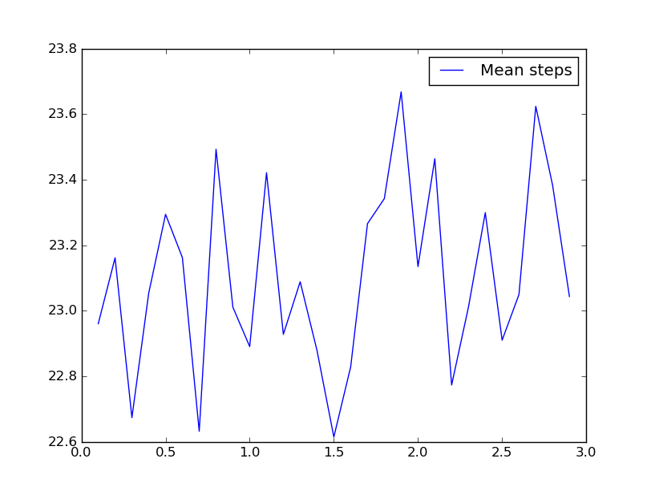
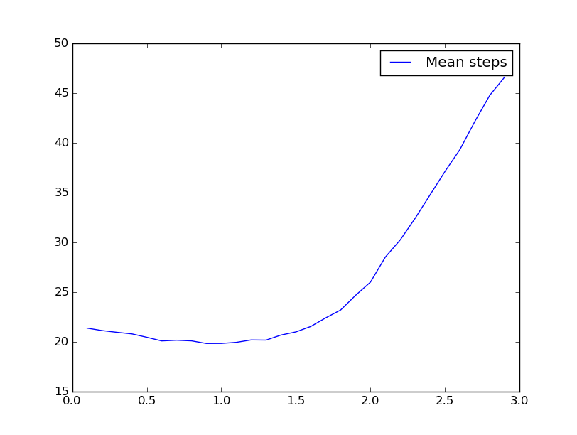
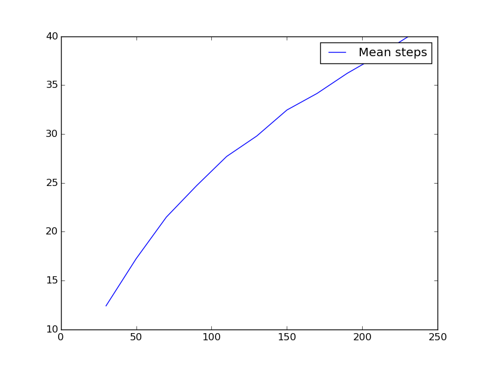
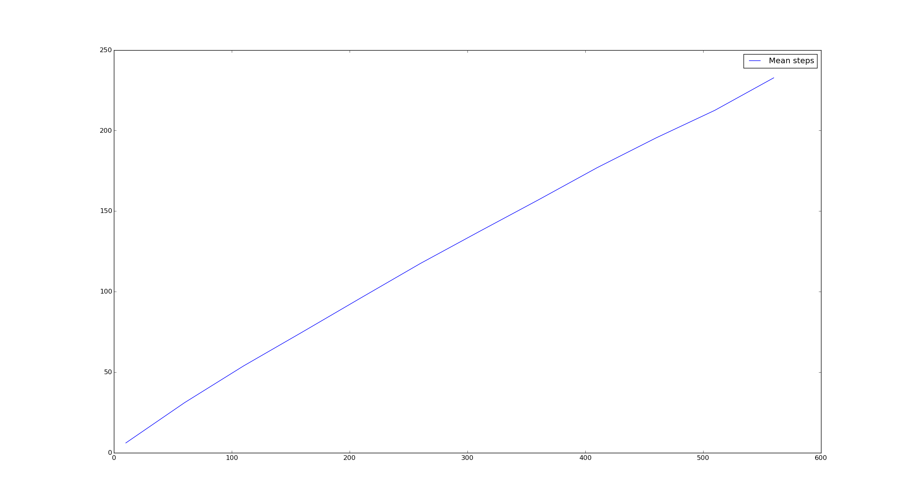

# What I tried

## How to find the shortcut of a given node

In the beginning, I wanted to first pick up a value for the distance and then to
uniformly pick a node among the equidistant nodes. Unfortunately, this does not
reduce the problem because the distribution is not easier to compute as the grid
is finite and there is no symmetry.

I then implemented a shortcut generator using a precomputed grid of distances:

    for i in range(N):
        for j in range(1 if i==0 else 0, N):
            d = distance(0, 0, i, j) ** (-r)
            global_distance_grid[N+i-1, N+j-1] = d
            global_distance_grid[N-i-1, N+j-1] = d
            global_distance_grid[N-i-1, N-j-1] = d
            global_distance_grid[N+i-1, N-j-1] = d

I extract then the local grid of distances from this global map, normalize it,
and randomly pick an element using this distribution.

Building the initial distance grid takes 3'40" on a single core, for N = 10000
(time complexity = O(N²)), and the grid is cached on disk.

This state is referenced by the git tag `basic-shortcut-finder`.

## The routing algorithm

Here I used no special technique but instead implemented the routing algorithm.
We only compute the shortcut if we need it, and if it has a equivalent distance
to what provide the neighbors, we don't use it.
If both neighbors allow to progress, we uniformly pick one.

I used parallelization to use all my cores.

For r=2, N=100 and Ntries=10000 I get an average of **23 steps**.

I then call `run_routing` for different values of `r`.

This gives the following (surprising) graph for N=100 and Ntries=10000:

Crap, I did not write my code to use different values of r in the first place,
and now I am always using the same r and global_distance_grid matrix!

## MemoryError: time for a new shortcut generation method

Anyway, I need to code another way of getting the shortcut, because of the
following issue.

Quickly enough I notice that the memory consumption is quite huge and that I
need to reduce the problem. I chose to come back to my initial idea, that I
rejected, because I thought... hmm well... Actually the idea was good (just a
bit more complex to implement):

1. we compute the number of destination nodes at distance `d`, as if the grid was infinite;
* the distribution is then "vector of number of nodes at distance i" * "d ^ (-r) for all the possible distances";
* pick a distance d according to the distribution;
* uniformly pick a node at this distance: if the node is out of the grid, start over from step 3.

By doing so, we remove the solutions out of the grid from the potential
destination nodes, which is equivalent to removing them from the initial
distribution since we try again.

## Even more advanced features

After a large number of reworking, error fixing (I was reusing the same
`shortcuts` map across iterations with different n, what an idiot), data caching
and feature improvements, I was able to produce the following graphs:

With **N=100**, Ntries=10000 and different values of r (took 8'22" on my
laptop):

We clearly see that the number of steps is minimum when r is less than 1.5, with
a **mean step number of 26.0 for r=2.0**.

For r > 2, the mean step number is increasing: the routing time is long for r>2.
**We can thus confirm this part of the Kleinberg theorem**. However, the routing
time doesn't appear to be larger for r<2, for this value of N.

# Probability laws

I then chose to iterate on the values of **n** instead of **r**, for r=2.0 and
for r=3.0. The results here are not very precise but can give some insight on
the corresponding laws.

For **r=2.0**, the routing time is supposed to be in O(log²(n)).

The graph is concave, and may be assimilated to a square logarithmic law.

***

For **r=3.0**, the routing time is supposed to be in O(n^a) for a>0.

Here the graph can be associated with such a law, for a **a** near 1.
